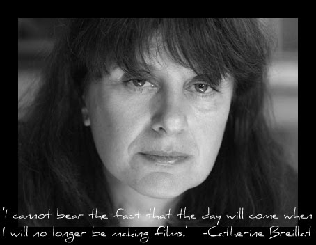

# Machine Learning & AI Foundations: Recommendations
Adam Geitgey / Lynda

Fun fun fun!

* [https://www.lynda.com/Data-Science-tutorials/Machine-Learning-Fundamentals-Learning-Make-Recommendations/563030-2.html](https://www.lynda.com/Data-Science-tutorials/Machine-Learning-Fundamentals-Learning-Make-Recommendations/563030-2.html)

# PYTHON FOR THE WIN

"If you give a chick a fish, she will smell fishy. If you teach her how to fish, she will use python to support women making films."

* [chicks_who_direct/](chicks_who_direct/)

* See [The Center for the Study of Women in Television and Film](http://womenintvfilm.sdsu.edu)
